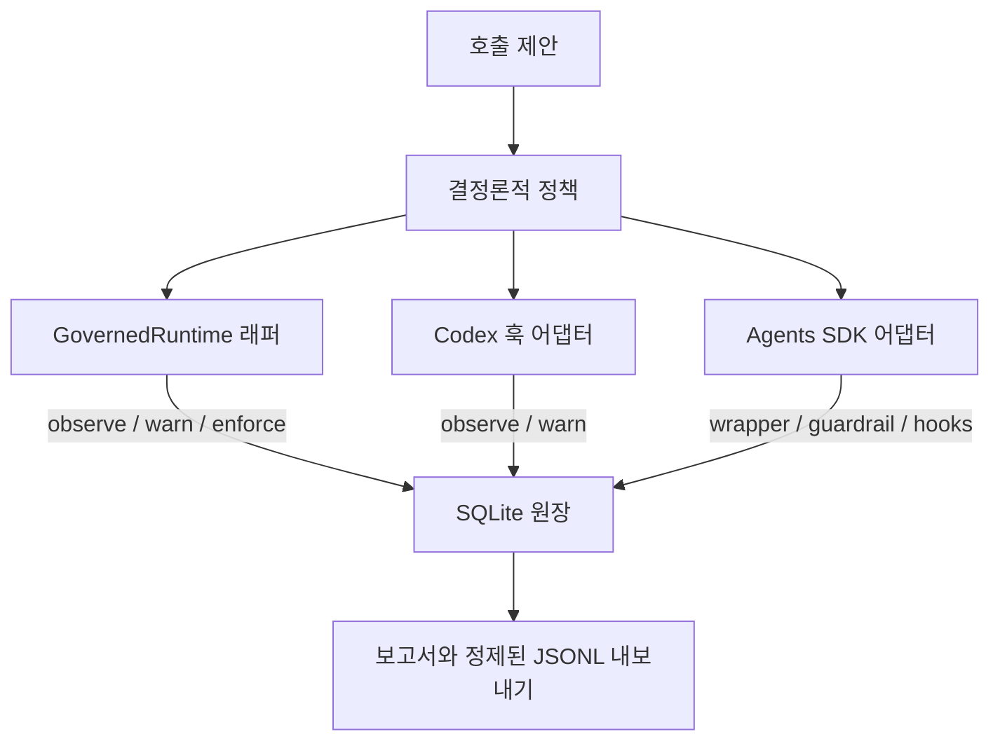

# Agent Call Governor

**한국어** · [English](README.md)

[](https://github.com/Kimuhwan/Agent-Call-Governor/actions/workflows/validate.yml)
[](LICENSE)
[](skills/agent-call-governor/SKILL.md)
[](pyproject.toml)

에이전트·도구·모델 호출의 품질을 보존하는 거버넌스 도구입니다.

Agent Call Governor는 비용 제어를 무조건적인 호출 금지로 바꾸지 않으면서 중복 호출, 소진된 재시도, 새 정보가 없는 호출을 줄입니다. Codex 스킬, 결정론적 정책, 애플리케이션 소유 런타임 래퍼, SQLite 원장, 선택형 Codex/OpenAI Agents SDK 어댑터를 함께 제공합니다.

> **v0.2.0 범위:** 래퍼로 감싼 호출은 실행 전에 차단할 수 있습니다. Codex 수명주기 훅은 관찰 또는 경고만 지원합니다. 이 프로젝트는 모든 호스트 호출을 가로채는 범용 agent-call firewall이 아닙니다.

## 제공 기능

| 계층 | 용도 | 강제력 |
| --- | --- | --- |
| Codex 스킬 | 위임 전에 최소 충분 경로 선택 | 프롬프트 수준 정책 |
| 정책 CLI | JSON 제안 하나를 결정론적으로 평가 | 호출자가 실행할 때 강제 |
| Python 런타임 | 애플리케이션 소유 동기/비동기 호출 게이트 및 결과 기록 | 감싼 호출의 사전 차단 |
| SQLite + JSONL | 권위 있고 조회 가능한 수명주기 이력 | 기록 및 보고서 |
| Codex 훅 | 도구/서브에이전트 수명주기 기록과 경고 | 관찰/경고 전용 |
| OpenAI Agents SDK | 전체 실행 래핑, 수명주기 관찰, 함수 도구 보호 | 전체 실행 래퍼와 공식 함수 도구 veto |

정책은 에이전트와 직접 도구 예산을 분리하고, 정규화된 중복을 차단하며, 충분한 결과나 진행 없음 이후 호출을 멈춥니다. 동시에 필수 호출과 고위험 변경 전략 재시도는 보존합니다.

## 구조



## 설치

저장소를 복제합니다.

```bash
git clone https://github.com/Kimuhwan/Agent-Call-Governor.git
cd Agent-Call-Governor
```

Codex 스킬을 설치합니다.

```powershell
# Windows PowerShell
powershell -ExecutionPolicy Bypass -File .\install.ps1
```

```bash
# macOS 또는 Linux
./install.sh
```

Codex를 다시 시작하세요. 스킬은 `~/.codex/skills/agent-call-governor`에 복사됩니다. 두 설치 스크립트는 해당 스킬 디렉터리를 깨끗하게 교체하며, `CODEX_HOME`이 설정되어 있으면 그 경로를 사용합니다.

애플리케이션에서 기록 또는 강제가 필요하면 Python 런타임을 설치합니다.

```bash
python -m pip install .
```

OpenAI Agents SDK 연동이 필요하면 다음을 사용합니다.

```bash
python -m pip install ".[agents]"
```

핵심 런타임에는 제3자 의존성이 없습니다. 선택형 SDK 추가 기능은 현재 `openai-agents>=0.18.2,<0.19`를 지원합니다.

## 빠른 시작: 호출 감싸기

```python
from agent_call_governor_runtime import CallLedger, CallProposal, GovernedRuntime

ledger = CallLedger(
    ".governor/events.sqlite3",
    ".governor/events.jsonl",  # 선택형 사람이 읽기 쉬운 미러
)
runtime = GovernedRuntime(
    ledger,
    mode="observe",             # observe -> warn -> enforce
    failure_policy="fail-open", # enforce 전 명시적으로 선택
)

proposal = CallProposal(
    session_id="support-42",
    objective="고객 주문 하나 조회",
    route="tool:lookup_order",
    capability_gap="현재 컨텍스트에 주문 상태가 없음",
    expected_new_information="현재 주문 상태",
    stop_condition="권위 있는 주문 레코드 하나가 반환됨",
    material_inputs={"order_id": "42"},
    budget_kind="direct-tool",
    profile="balanced",
    quality_risk="medium",
)

def lookup_order(order_id: str) -> dict[str, str]:
    return {"order_id": order_id, "status": "paid"}

result = runtime.run(proposal, lookup_order, "42")
```

비동기 함수에는 `await runtime.run_async(...)`를 사용합니다.

다음 순서로 도입하는 것을 권장합니다.

1. **Observe:** 모든 호출을 실행하면서 정책이 무엇을 차단할지 측정합니다.
2. **Warn:** 실행은 유지하되 차단 예정 결정을 경고합니다.
3. **Enforce:** 거부된 호출을 감싼 함수 실행 전에 차단합니다.
4. 가용성이 우선이면 **fail-open**, 평가·기록되지 않은 호출을 허용할 수 없다면 **fail-closed**를 선택합니다.

## 원장 확인

```bash
agent-call-governor-runtime report --db .governor/events.sqlite3
agent-call-governor-runtime report --db .governor/events.sqlite3 --json
agent-call-governor-runtime export-jsonl \
  --db .governor/events.sqlite3 \
  --output .governor/export.jsonl
```

SQLite가 권위 있는 원장이며 JSONL은 선택형 best-effort 미러 또는 내보내기 형식입니다. 미러 쓰기 실패는 경고로 알리되 이미 커밋된 SQLite 결정을 무효화하지 않습니다. 기본 이벤트에는 원문 objective/프롬프트, material input, 도구 인자, 도구 결과, transcript, 예외 메시지가 들어가지 않습니다. objective는 SHA-256 참조값으로 저장하고, 그 밖에는 fingerprint, 수명주기 단계, 결정, 진행도, 소요 시간, 명시적으로 안전한 메타데이터만 기록합니다.

호출 전 이력 조회, 정책 판단, `started`/`blocked` 예약은 하나의 SQLite 트랜잭션으로 커밋됩니다. 따라서 동시에 들어온 enforce 호출이 같은 마지막 예산 슬롯을 함께 소비하거나 같은 fingerprint를 둘 다 실행할 수 없습니다.

## Codex에서 사용

스킬을 직접 호출할 수 있습니다.

```text
$agent-call-governor를 balanced 모드로 사용하고 최소 충분 위임으로 이 작업을 완료해줘.
```

자동 수명주기 기록은 [Codex 훅 안내](skills/agent-call-governor/references/codex-hooks.md)와 [hooks.json 예제](examples/codex-hooks.json)를 따라 `PreToolUse`, `PostToolUse`, `SubagentStart`, `SubagentStop`을 설정하세요. `turn_id`가 있으면 정책 이력을 Codex 턴 단위로 분리하므로 긴 스레드가 하나의 영구 예산을 소진하지 않으며, 같은 호스트 이벤트의 재전달은 멱등 처리합니다. Codex session, turn, tool-use, agent ID는 SHA-256 참조값으로만 저장합니다.

현재 Codex 훅 계약은 도구 또는 서브에이전트를 신뢰성 있게 사전 차단하는 기능을 제공하지 않습니다. 그래서 어댑터는 `enforce`를 거부하고 지원되는 경고 필드만 반환합니다. 실행 전 차단이 필요하면 `GovernedRuntime`을 사용하세요.

## OpenAI Agents SDK

선택형 어댑터는 다음 기능을 제공합니다.

- `GovernedRunner`: 전체 `Runner.run`, `Runner.run_sync` 워크플로를 애플리케이션 소유 경계에서 강제하고 기본적으로 매 실행마다 새 내부 관찰 훅 주입
- `build_function_tool_guardrail`: SDK가 공식 지원하는 `FunctionTool` 입력 veto
- `build_run_hooks`: 에이전트, LLM, 로컬 도구, handoff 수명주기를 관찰/경고 모드로 기록

자세한 내용은 [Agents SDK 연동 안내](skills/agent-call-governor/references/openai-agents-sdk.md)를 참고하세요. 함수 도구 guardrail은 모든 hosted tool 계열이나 확장을 포괄하지 않습니다. 필수 외부 게이트가 필요하면 전체 실행을 감싸세요.

## 결정론적 정책 CLI

v0.1 JSON 제안 필드와 CLI 종료 코드는 그대로 호환됩니다.

```bash
agent-call-governor evaluate examples/proposal.json
# 또는
python skills/agent-call-governor/scripts/governor.py evaluate examples/proposal.json
```

종료 코드는 허용 `0`, 정책 거부 `2`, 잘못된 입력 `1`입니다. [제안 스키마](skills/agent-call-governor/references/proposal-schema.md)와 [프로필 상세](skills/agent-call-governor/references/profiles.md)를 참고하세요.

### v0.1 fingerprint 이력 마이그레이션

v0.2 fingerprint는 문자열 대소문자와 배열 순서를 의도적으로 보존합니다. 대소문자 구분 식별자나 순서가 중요한 작업을 잘못 같은 호출로 합치는 것을 막기 위해서입니다. JSON 인터페이스는 같아도 v0.1이 만든 fingerprint 값과 달라질 수 있습니다. v0.2 enforce를 켜기 전에 새 governance session/scope를 시작하거나 기존 이력을 v0.2로 다시 계산하세요. 구버전과 신버전 fingerprint 이력을 섞은 채 버전 간 중복 탐지를 기대하면 안 됩니다.

## 프로필과 품질 바닥

| 프로필 | 적합한 작업 | 동작 |
| --- | --- | --- |
| `strict` | 되돌리기 쉽고 위험이 낮으며 지연이 중요한 작업 | 작은 예산, 단 고위험 작업에는 변경 전략 재시도 보장 |
| `balanced` | 일반적인 제품·엔지니어링 작업 | 보통의 검증을 보존하면서 낭비 제거 |
| `quality-first` | 영향이 크거나 오류 수정 비용이 높은 작업 | 더 큰 위험 바닥과 변경 전략 재시도 2회 |

최신성, 명시적 검증, 고위험, 비공개 상태, 누락 파일, 사용자 요청 작업, 안전, 시스템 지시를 위한 필수 호출은 일반 예산을 넘을 수 있습니다. 정확히 같은 중복은 반복 부작용을 막기 위해 계속 차단합니다.

## 평가 근거

정책의 양쪽을 보호하는 두 결정론적 평가 모음이 있습니다.

- 정책 회귀 평가: **19/19**
- 런타임 재생 평가: **64/64** 워크로드, **128** 호출 단계
- 필요 호출 보존: **96/96 (100%)**
- 불필요 호출 차단: **32/32 (100%)**
- 중복 호출 차단: **16/16 (100%)**
- 재생 세트의 under-call 회귀: **0**

[평가 방법](evals/README.md), [런타임 재생 결과](evals/runtime-results-2026-07-14.md), 이전 [Codex 매칭 A/B 시험](evals/results-2026-07-13.md)을 확인할 수 있습니다. 이는 회귀 및 방향성 결과이며 운영 환경의 성공률이나 절감률 주장이 아닙니다.

## 명확한 한계

- 강제력은 애플리케이션이 `GovernedRuntime`, `GovernedRunner`, 또는 지원되는 SDK guardrail을 사용하는 위치에만 적용됩니다.
- Codex 훅은 관찰하고 경고할 수 있지만 현재 범용 veto를 제공할 수 없습니다.
- 재생 평가는 체크인된 결정론적 세트이며 실제 운영 워크로드 벤치마크가 아닙니다.
- fingerprint와 objective 해시 참조는 저장 내용을 줄이는 식별자이지 암호화가 아닙니다. 원장을 내보내기 전에 안전한 메타데이터인지 검토하세요.
- 입력 전용 함수 도구 guardrail은 최종 결과를 알 수 없으므로 보수적으로 `started` 상태를 기록합니다.

## 로컬 검증

```bash
python -m pip install -e .
python -m unittest discover -s tests -v
python evals/run_evals.py
python evals/run_runtime_evals.py
python ~/.codex/skills/.system/skill-creator/scripts/quick_validate.py skills/agent-call-governor
python -m build
```

공식 Codex 스킬 검증기에는 PyYAML이 필요합니다. 빌드 명령에는 선택형 개발 의존성을 설치하세요: `python -m pip install -e ".[dev]"`.

## 프로젝트 구조

```text
skills/agent-call-governor/
  SKILL.md                         Codex 정책 지침
  references/                      정책과 연동 안내
  scripts/governor.py              이전 버전 호환 정책 CLI
  scripts/codex_hook.py            Codex stdin/stdout 훅 명령
  scripts/agent_call_governor_runtime/
                                    설치 가능한 정책, 원장, 런타임, 어댑터, CLI
examples/                           제안 및 Codex 훅 설정 예제
evals/                              정책 케이스, 런타임 워크로드, 체크인 결과
tests/                              무의존성 및 선택형 SDK 테스트
```

## 기여

Issue와 Pull Request를 환영합니다. 품질 바닥을 보존하고, 과도한 호출과 부족한 호출 양쪽에 테스트를 추가하며, 공개 주장은 재현 가능한 근거에 연결해 주세요.

## 라이선스

[MIT](LICENSE)
