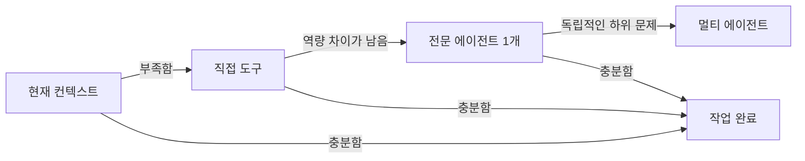

# Agent Call Governor

**한국어** · [English](README.md)

[](https://github.com/Kimuhwan/Agent-Call-Governor/actions/workflows/validate.yml)
[](LICENSE)
[](agent-call-governor/SKILL.md)

정확성은 유지하면서 불필요한 에이전트 호출을 줄이는 Codex 스킬입니다.

Agent Call Governor는 위임·재시도·멀티 에이전트 실행 전에 최소 충분 호출 원칙을 적용합니다. 명시적인 호출 예산, 중복 fingerprint, 진행 게이트, 정지 조건을 조합해 비용과 지연을 줄이고 작업의 완결성을 지킵니다.

## 왜 필요한가요?

복잡한 모델은 간단한 작업을 지나치게 분해하거나, 새 정보가 없는 호출을 반복하거나, 직접 조회할 일을 다시 에이전트에 위임할 수 있습니다. 이 스킬은 Codex가 다음 순서로 판단하게 합니다.



직접 도구와 에이전트 호출 예산은 별도로 관리합니다. 최신성, 검증, 안전, 비공개 상태 접근, 사용자가 명시한 작업에 필요한 호출은 억제하지 않습니다.

## 설치

### Windows PowerShell

```powershell
git clone https://github.com/Kimuhwan/Agent-Call-Governor.git
powershell -ExecutionPolicy Bypass -File .\Agent-Call-Governor\install.ps1
```

### macOS 또는 Linux

```bash
git clone https://github.com/Kimuhwan/Agent-Call-Governor.git
./Agent-Call-Governor/install.sh
```

설치 후 Codex를 다시 시작하세요. 스킬은 `~/.codex/skills/agent-call-governor`에 설치됩니다.

## 사용

프롬프트에서 명시적으로 호출할 수 있습니다.

```text
$agent-call-governor를 사용해서 이 저장소를 최소한의 충분한 위임으로 조사해줘.
```

Codex가 위임, 재호출, 멀티 에이전트 작업을 계획할 때 암시적으로도 실행될 수 있습니다.

## 판단 방식

호출 전에는 역량 차이, 예상되는 새 정보, 가장 저렴한 충분 경로, 남은 예산, 정지 조건, 정규화된 fingerprint를 확인합니다. 각 결과 이후에는 진행 상태를 분류합니다.

| 결과 | 동작 |
| --- | --- |
| `sufficient` | 호출을 멈추고 작업 완료 |
| `material_progress` | 남은 문제가 명확한 경우에만 계속 |
| `low_progress` | 전략을 바꾼 호출 1회만 허용 |
| `no_progress` | 위임을 멈추고 근거가 있는 최선의 결과 제공 |

전체 정책은 [SKILL.md](agent-call-governor/SKILL.md)에서 확인할 수 있습니다.

## 선택적 결정론적 게이트

호출이 많은 워크플로에서는 무의존성 Python 도구로 중복과 예산 초과를 차단할 수 있습니다.

```bash
python agent-call-governor/scripts/governor.py evaluate examples/proposal.json
```

호출 허용 시 종료 코드 `0`, 정책상 거절 시 `2`, 잘못된 입력은 `1`을 반환합니다. 자세한 입력 형식은 [proposal 스키마](agent-call-governor/references/proposal-schema.md)를 참고하세요.

## 로컬 검증

```bash
python -m unittest discover -s tests -v
python ~/.codex/skills/.system/skill-creator/scripts/quick_validate.py agent-call-governor
```

정책과 실행 도구에는 별도 런타임 의존성이 없습니다. Codex 공식 스킬 검증기에는 PyYAML이 필요합니다.

## 프로젝트 구조

```text
agent-call-governor/     Codex가 인식하는 스킬
  agents/openai.yaml     Codex UI 메타데이터
  references/            필요할 때만 읽는 제안 스키마
  scripts/governor.py    선택적 결정론적 게이트
examples/                바로 실행 가능한 입력 예제
tests/                   표준 라이브러리 단위 테스트
```

## 기여

이슈와 Pull Request를 환영합니다. 핵심 스킬은 간결하게 유지하고, 가능한 동작은 결정론적 도구에 구현하며, 정책 변경에는 테스트를 함께 추가해 주세요.

## 라이선스

[MIT](LICENSE)
