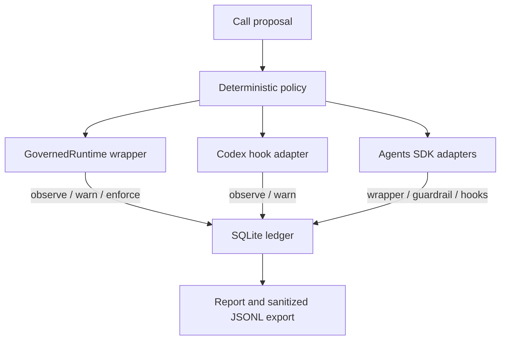

# Agent Call Governor

[한국어](README.ko.md) · **English**

[](https://github.com/Kimuhwan/Agent-Call-Governor/actions/workflows/validate.yml)
[](LICENSE)
[](agent-call-governor/SKILL.md)
[](pyproject.toml)

Quality-preserving governance for agent, tool, and model calls.

Agent Call Governor reduces duplicate, exhausted, and no-new-information calls without turning cost control into a blanket ban. It combines a Codex skill, a deterministic policy, an application-owned runtime wrapper, an authoritative SQLite ledger, and optional Codex/OpenAI Agents SDK adapters.

> **v0.2.0 scope:** wrapped calls can be blocked before execution. Codex lifecycle hooks observe or warn only. This project is not a universal host-level agent-call firewall.

## What you get

| Layer | Purpose | Enforcement |
| --- | --- | --- |
| Codex skill | Choose the minimum sufficient route before delegation | Prompt-level policy |
| Policy CLI | Evaluate one JSON proposal deterministically | Enforced when the caller invokes it |
| Python runtime | Gate sync/async application-owned calls and record outcomes | Pre-call block for wrapped calls |
| SQLite + JSONL | Keep authoritative, queryable lifecycle history | Recording and reports |
| Codex hooks | Record tool/subagent lifecycle and surface warnings | Observe/warn only |
| OpenAI Agents SDK | Wrap complete runs, observe lifecycle, guard function tools | Whole-run wrapper and supported function-tool veto |

The policy budgets agent calls separately from direct tools, blocks normalized duplicates, stops after sufficient/no-progress results, and preserves mandatory calls and high-risk changed-strategy retries.

## Architecture



## Install

Clone once:

```bash
git clone https://github.com/Kimuhwan/Agent-Call-Governor.git
cd Agent-Call-Governor
```

Install the Codex skill:

```powershell
# Windows PowerShell
powershell -ExecutionPolicy Bypass -File .\install.ps1
```

```bash
# macOS or Linux
./install.sh
```

Restart Codex. The skill is copied to `~/.codex/skills/agent-call-governor`. Both installers replace that skill directory cleanly and honor `CODEX_HOME` when it is set.

Install the Python runtime when your application needs logging or enforcement:

```bash
python -m pip install .
```

For OpenAI Agents SDK integration:

```bash
python -m pip install ".[agents]"
```

The core runtime has no third-party dependency. The optional extra currently supports `openai-agents>=0.18.2,<0.19`.

## Quick start: wrap a call

```python
from agent_call_governor_runtime import CallLedger, CallProposal, GovernedRuntime

ledger = CallLedger(
    ".governor/events.sqlite3",
    ".governor/events.jsonl",  # optional human-readable mirror
)
runtime = GovernedRuntime(
    ledger,
    mode="observe",             # observe -> warn -> enforce
    failure_policy="fail-open", # choose explicitly before enforce rollout
)

proposal = CallProposal(
    session_id="support-42",
    objective="Look up one customer order",
    route="tool:lookup_order",
    capability_gap="The order state is not in local context",
    expected_new_information="The current order status",
    stop_condition="One authoritative order record is returned",
    material_inputs={"order_id": "42"},
    budget_kind="direct-tool",
    profile="balanced",
    quality_risk="medium",
)

def lookup_order(order_id: str) -> dict[str, str]:
    return {"order_id": order_id, "status": "paid"}

result = runtime.run(proposal, lookup_order, "42")
```

For an async callable, use `await runtime.run_async(...)`.

Roll out in this order:

1. **Observe:** execute every call and measure what the policy would block.
2. **Warn:** keep executing but surface would-block decisions.
3. **Enforce:** block denied calls before the wrapped callable runs.
4. Choose **fail-open** when availability wins, or **fail-closed** when an unevaluated/unrecorded call must not proceed.

## Inspect the ledger

```bash
agent-call-governor-runtime report --db .governor/events.sqlite3
agent-call-governor-runtime report --db .governor/events.sqlite3 --json
agent-call-governor-runtime export-jsonl \
  --db .governor/events.sqlite3 \
  --output .governor/export.jsonl
```

SQLite is authoritative; JSONL is an optional best-effort mirror or export. A mirror write failure is reported as a warning but never invalidates a committed SQLite decision. By default, events do **not** contain raw objectives/prompts, material inputs, tool arguments, tool results, transcripts, or exception messages. Objectives are stored as SHA-256 references; events otherwise contain fingerprints, lifecycle phases, decisions, progress, duration, and explicitly safe metadata.

Pre-call history, policy evaluation, and the `started`/`blocked` reservation are committed in one SQLite transaction. Concurrent enforce calls therefore cannot both consume the same final budget slot or execute the same fingerprint.

## Use it in Codex

Invoke the skill directly:

```text
Use $agent-call-governor in balanced mode and complete this task with the minimum sufficient delegation.
```

For automatic lifecycle recording, configure `PreToolUse`, `PostToolUse`, `SubagentStart`, and `SubagentStop` from [the Codex hook guide](agent-call-governor/references/codex-hooks.md) and [example hooks.json](examples/codex-hooks.json). Policy history is scoped to a Codex turn when `turn_id` is available, so a long-lived thread does not exhaust one permanent budget; repeated delivery of the same host event is idempotent. Codex session, turn, tool-use, and agent IDs are stored only as SHA-256 references.

Current Codex hook contracts do not provide a dependable pre-tool/subagent veto. The adapter therefore rejects `enforce` and returns only supported warning fields. Use `GovernedRuntime` when the call must be stopped before execution.

## OpenAI Agents SDK

The optional adapter provides:

- `GovernedRunner` for application-owned enforcement around complete `Runner.run` and `Runner.run_sync` workflows, with a fresh internal observer hook injected by default;
- `build_function_tool_guardrail` for the SDK's supported `FunctionTool` input veto;
- `build_run_hooks` for observe/warn lifecycle recording across agent, LLM, local tool, and handoff events.

See the [Agents SDK integration guide](agent-call-governor/references/openai-agents-sdk.md). Function-tool guardrails do not cover every hosted tool family or extension; wrap the whole run when a mandatory outer gate is required.

## Deterministic policy CLI

The v0.1 JSON proposal fields and CLI exit codes remain compatible:

```bash
agent-call-governor evaluate examples/proposal.json
# or
python agent-call-governor/scripts/governor.py evaluate examples/proposal.json
```

Exit codes are `0` for allowed, `2` for policy denial, and `1` for invalid input. See the [proposal schema](agent-call-governor/references/proposal-schema.md) and [profile details](agent-call-governor/references/profiles.md).

### Migrating fingerprint history from v0.1

v0.2 intentionally preserves string case and list order in fingerprints. This prevents case-sensitive identifiers and ordered operations from being collapsed into a false duplicate. Fingerprint values produced by v0.1 may therefore differ even though the JSON interface is unchanged. Before enabling v0.2 enforcement, start a new governance session/scope or recompute stored history with v0.2; do not mix old and new fingerprint histories and expect cross-version duplicate matching.

## Profiles and quality floor

| Profile | Best for | Behavior |
| --- | --- | --- |
| `strict` | Reversible, low-risk, latency-sensitive work | Small budgets; high-risk work still gets a changed-strategy retry |
| `balanced` | Default product and engineering work | Removes waste while preserving ordinary verification |
| `quality-first` | High-impact or costly-to-correct work | Larger risk floors and two changed-strategy retries |

Mandatory calls for freshness, explicit verification, high stakes, private state, missing files, requested actions, safety, and system instructions can exceed ordinary budgets. Exact duplicates remain blocked to avoid repeated side effects.

## Evaluation evidence

Two deterministic suites protect both sides of the policy:

- policy regression: **19/19** cases;
- runtime replay: **64/64** workloads and **128** call steps;
- necessary-call preservation: **96/96 (100%)**;
- redundant-call blocking: **32/32 (100%)**;
- duplicate blocking: **16/16 (100%)**;
- under-call regressions in the replay set: **0**.

See [evaluation methodology](evals/README.md), [runtime replay results](evals/runtime-results-2026-07-14.md), and the earlier [matched Codex A/B trial](evals/results-2026-07-13.md). These are regression and directional results, not production success-rate or savings claims.

## Honest limitations

- Enforcement applies only where an application uses `GovernedRuntime`, `GovernedRunner`, or a supported SDK guardrail.
- Codex hooks can observe and warn, but cannot currently provide the claimed universal veto.
- The replay suite is deterministic and checked in; it is not a live production workload benchmark.
- Fingerprints and objective hash references minimize stored content but are identifiers, not encryption. Review safe metadata before exporting a ledger.
- Input-only function-tool guardrails record a conservative `started` state because they cannot know the eventual result.

## Validate locally

```bash
python -m pip install -e .
python -m unittest discover -s tests -v
python evals/run_evals.py
python evals/run_runtime_evals.py
python ~/.codex/skills/.system/skill-creator/scripts/quick_validate.py agent-call-governor
python -m build
```

The official Codex skill validator requires PyYAML. The build command requires the optional development dependencies: `python -m pip install -e ".[dev]"`.

## Project layout

```text
agent-call-governor/
  SKILL.md                         Codex policy instructions
  references/                      Policy and integration guides
  scripts/governor.py              Backward-compatible policy CLI
  scripts/codex_hook.py            Codex stdin/stdout hook command
  scripts/agent_call_governor_runtime/
                                    Installable policy, ledger, runtime, adapters, CLI
examples/                           Proposal and Codex hook configuration
evals/                              Policy cases, runtime workloads, checked-in results
tests/                              Dependency-free and optional-SDK tests
```

## Contributing

Issues and pull requests are welcome. Preserve the quality floor, add tests for both over-calling and under-calling, and keep public claims tied to reproducible evidence.

## License

[MIT](LICENSE)
