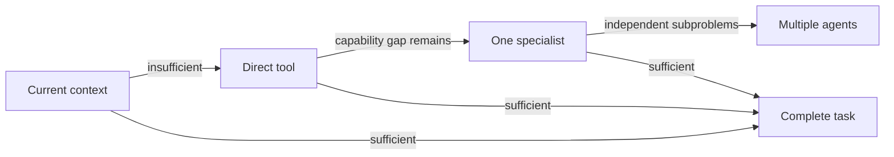

# Agent Call Governor

[한국어](README.ko.md) · **English**

[](https://github.com/Kimuhwan/Agent-Call-Governor/actions/workflows/validate.yml)
[](LICENSE)
[](agent-call-governor/SKILL.md)

Remove wasted calls without turning quality controls into a blanket ban.

Agent Call Governor is a lightweight [Codex skill](agent-call-governor/SKILL.md) that applies a quality-preserving call policy before delegation, retries, and multi-agent workflows. It combines risk-aware budgets, duplicate fingerprints, progress gates, and observable stop conditions.

## Why use it?

Complex models can over-decompose simple work, repeat calls that add no information, or delegate direct lookups to another agent. This skill gives Codex a consistent decision order:



Direct tools and agent calls are budgeted separately. Required calls for freshness, verification, safety, private state, or explicit user actions are never suppressed.

The objective is **minimum sufficient calls**, not minimum calls. When cost controls would materially increase the chance of an incorrect, stale, unsafe, or incomplete result, the quality floor wins.

## Install

### Windows PowerShell

```powershell
git clone https://github.com/Kimuhwan/Agent-Call-Governor.git
powershell -ExecutionPolicy Bypass -File .\Agent-Call-Governor\install.ps1
```

### macOS or Linux

```bash
git clone https://github.com/Kimuhwan/Agent-Call-Governor.git
./Agent-Call-Governor/install.sh
```

Restart Codex after installation. The skill is installed at `~/.codex/skills/agent-call-governor`.

## Use

Invoke it explicitly:

```text
Use $agent-call-governor to investigate this repository with the minimum sufficient delegation.
```

It can also trigger implicitly when Codex is about to delegate, retry a call, or plan a multi-agent workflow.

## How decisions are made

Before a call, Codex identifies the capability gap, expected new information, cheapest sufficient route, remaining budget, stop condition, and normalized fingerprint. After every result it classifies progress:

| Result | Behavior |
| --- | --- |
| `sufficient` | Stop and complete the task |
| `material_progress` | Continue only for a defined remaining gap |
| `low_progress` | Allow one changed-strategy attempt |
| `no_progress` | Stop delegation and report the best supported result |

See [SKILL.md](agent-call-governor/SKILL.md) for the complete policy.

## Profiles

| Profile | Best for | Behavior |
| --- | --- | --- |
| `strict` | Reversible, low-risk, latency-sensitive work | Small budgets; high-risk work still gets one changed-strategy retry |
| `balanced` | Default product and engineering work | Removes waste while preserving ordinary verification |
| `quality-first` | High-impact or costly-to-correct work | Larger risk floors and two changed-strategy retries |

High-risk work automatically receives a minimum safe budget even when a lower limit is configured. Mandatory calls can exceed the budget, but exact duplicate fingerprints remain blocked to prevent repeated side effects. See [profile details](agent-call-governor/references/profiles.md).

## Optional deterministic gate

For long-running workflows, the zero-dependency Python helper can block duplicate or over-budget proposals:

```bash
python agent-call-governor/scripts/governor.py evaluate examples/proposal.json
```

The command returns exit code `0` when allowed, `2` when rejected by policy, and `1` for invalid input. See the [proposal schema](agent-call-governor/references/proposal-schema.md) for details.

## Current scope

Version 0.1.0 is **prompt-level governance with optional deterministic enforcement**. The skill guides Codex before delegation, while `governor.py` enforces a decision only when a caller explicitly invokes it.

It does not yet intercept every Codex or SDK call automatically, collect authoritative runtime telemetry, or act as a complete agent-call firewall. Runtime logging and pre-call/post-call integration are the next layer of the project.

## Validate locally

```bash
python -m unittest discover -s tests -v
python evals/run_evals.py
python ~/.codex/skills/.system/skill-creator/scripts/quick_validate.py agent-call-governor
```

The policy itself has no runtime dependencies. The official Codex skill validator requires PyYAML.

The [evaluation suite](evals/README.md) reports both `quality_preservation_rate` and `waste_control_rate`. This prevents call reduction from looking successful when it merely causes under-calling. These regression scores measure rule consistency, not a production success-rate claim. See the [latest checked-in results](evals/results-2026-07-13.md).

In the first matched Codex A/B trial, both conditions completed 4/4 tasks. The balanced Governor reduced total calls from 9 to 3 while a blind judge preferred its answer quality (8.88 vs. 8.63). This is a single directional trial, not a production benchmark. The trial also exposed budget-history and high-risk retry edge cases, which are now covered by regression tests.

## Project layout

```text
agent-call-governor/     Codex-discoverable skill
  agents/openai.yaml     Codex UI metadata
  references/            On-demand proposal schema
  scripts/governor.py    Optional deterministic gate
examples/                Ready-to-run proposal input
evals/                   Quality-preservation and waste-control cases
tests/                   Standard-library unit tests
```

## Contributing

Issues and pull requests are welcome. Keep the core skill concise, add deterministic behavior to the helper when possible, and include tests for policy changes.

## License

[MIT](LICENSE)
